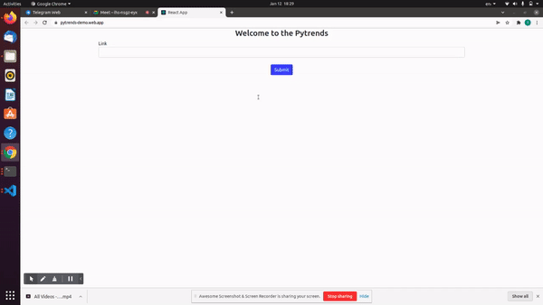

<h1 align="center">
    <b> Google Trends </b> 
<br>
</h1>

## What is this for?
This repository give you information about Google trends and Predition data. 


## File Path
Here is the file path for Google Trends ML Model.
```/GoogleTrendsAPI/GoogleTrends.ipynb```

You can use the GoogleTrends file in your Colab setup

## Installation
```pip install flask-ngrok```

```pip install pyngrok```

```pip install -U flask-cors```

```pip install darts```

```pip install pyyaml```

```pip install pytrends```


## Instruction
First, set up this repository on your local machine or colab.
Installing all dependency in your Machine and authentication your ngrok token. 
 
To run 
run all the jupiter or colab cell

To make changes
at line 7 on ```ngrok authtoken "<_YOUR_NGROK_TOKEN_>"``` this is your ngrok token.


## React Installation

Clone the Application on your local system.
After cloning the application on your local system use ```cd Pytrends-python-ML-Model``` command to go to the Pytrends ML model Directory 

Install the default dependencies by running the following command.


```npm install```


## To start your Local server


```npm start```


## Sample video




